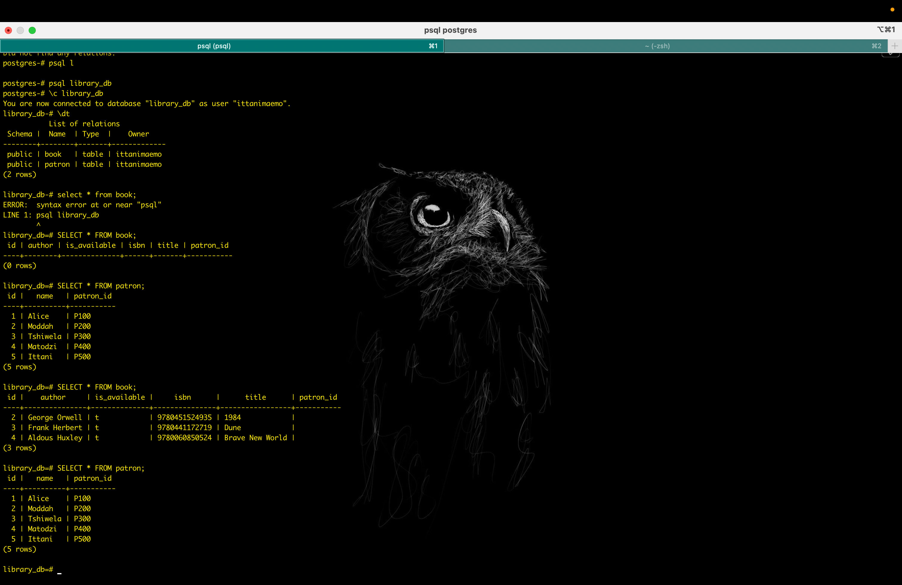
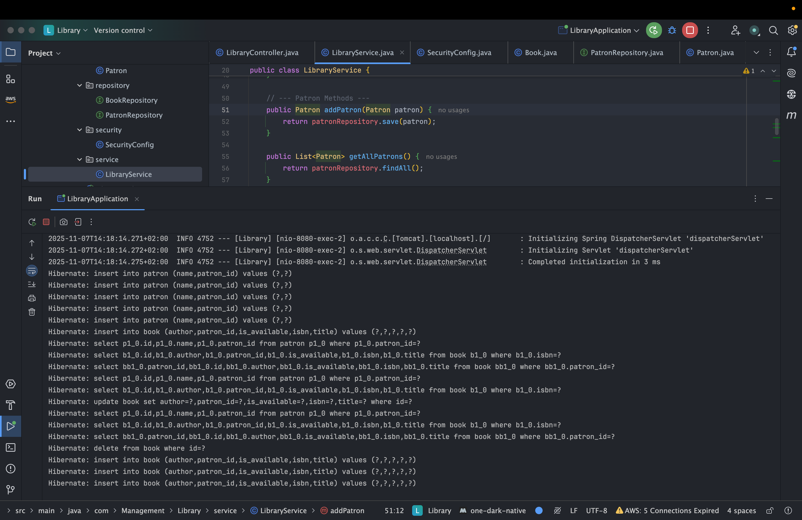

# 📚 Library Management System

This is a **full-stack, database-driven** version of the Library Management System, built with **Spring Boot**.  
It provides a **REST API** for managing books and patrons, persists data in a **PostgreSQL** database using **JPA**, and is secured with basic authentication.

---

## 🏗️ Application Structure (The 3-Tier Architecture)

The project follows a **professional multi-tier architecture**, separating concerns for better scalability and maintainability:

### **1. com.library.controller (Presentation Layer)**
- **`LibraryController.java`**: A `@RestController` that defines the API endpoints (URLs).  
  It handles HTTP requests, parses incoming JSON, and calls the Service layer.

### **2. com.library.service (Business Logic Layer)**
- **`LibraryService.java`**: A `@Service` that contains all the core business logic (e.g., the rules for checking out a book).  
  It coordinates with the repositories.

### **3. com.library.repository (Data Access Layer)**
- **`BookRepository.java`** & **`PatronRepository.java`**: `@Repository` interfaces extending `JpaRepository`.  
  Spring Data JPA automatically provides implementations for CRUD operations.

### **4. com.library.model (Domain/Entity Layer)**
- **`Book.java`** & **`Patron.java`**: `@Entity` classes mapped directly to database tables.

### **5. com.library.security (Security Layer)**
- **`SecurityConfig.java`**: Configures basic authentication for the app.  
  In-memory users:
    - **user / password**
    - **admin / admin123**

---

## ⚙️ How to Build and Run (with Maven & PostgreSQL)

### **Prerequisites**
Ensure the following are installed and configured:
- ☕ Java JDK 17+
- 🧰 Apache Maven
- 🐘 PostgreSQL 15+ (running locally on port `5432`)

---

### **Setup**

#### 1. Create the Database
Open your terminal or **psql** shell and run:
```sql
CREATE DATABASE library_db;
```

